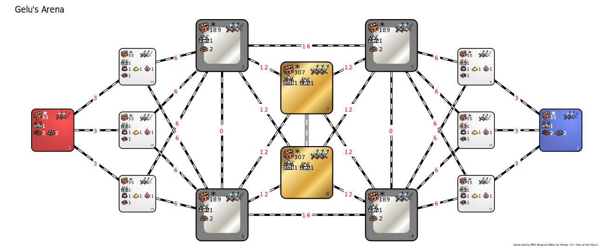

[<<-home](../..)

## Gelu's Arena

[Download Gelu's Arena 1.0](./Gelu's%20Arena%201.0.zip)

### Description
Gelu is a well-known hero in both the ingame lore and the H3 community - and this is the arena designed to pay homage to him. While he isn't available as one of the heroes, an army of Sharpshooter awaits recruitment here.

### Recommended settings
* Map size: L+U
* Player count: 2
* AI players: 0
* Teams: none
* Water: none
* Monsters: strong
* Difficulty: 160%
* Chess timer: 16:00+8:00+1:00
* Roads: medium
* Sim turns: 121

### Template specifications

* Map size: L+U
* Zones 1 and 2 are the players' starting zones.
    * Treasure values: (500-5000, 14), (3000-6000, 6), (10000-15000, 1)
    * Terrain is corresponding to the towns chosen by the players.
    * Gold has increased frequency to 500.
* Zones 9-14 are players' secondary zones.
    * Treasure values: (3000-6000, 12), (10000-15000, 8), (15000-20000, 2)
    * Towns spawning in these zones are always different to the player's choices.
    * Zones 10 and 13 spawn underground, while the other four zones spawn on the surface.
    * The following objects are disabled:
        * Pandora's boxes containing creatures, gold or spells
        * Stables
        * Skeleton Transformer
    * A single Redwood observatory, Wolf Raider Picket, Dragon Fly Hive and Treetop Tower spawn in each of these zones.
    * Terrain is left random.
* Zones 3-6 are the juniction zones.
    * Treasure values: (500-5000, 14), (3000-6000, 6), (10000-15000, 1)
    * Towns spawning in zones 3 and 4 are of the same type as the blue player's choice, while towns in zones 5 and 6 are of the same type as red's player choice.
    * These zones can only spawn on the surface layer.
    * The following objects are disabled:
        * Pandora's boxes
        * Creature banks
    * Each of these zones contain up to four Pandora's Boxes with Sharpshooters and up to four Treetop Towers.
    * Terrain is corresponding to the town of the zone.
* Zones 7 and 8 are the super treasure zones.
    * Treasure values: (10000-15000, 12), (15000-20000, 9)
    * These zones can only spawn underground.
    * The following objects are disabled:
        * Pandora's boxes containing creatures, experience or spells
        * Artifacts of treasure class
        * Quest artifacts.
    * The following objects are near-guaranteed to spawn:
        * 3 Dragon Fly Hives
        * 2 Griffin Conservatories
        * 3 Wolf Raider Pickets
        * 2 Experimental Shops
        * 3 Dragon Utopias
        * 1 Red Tower
    * Each of the objects described above have modified object value in these zones
        * Dragon Fly Hives, Wolf Raider Pickets and Red Towers - 12000
        * Griffin Conservatories and Experimental Shops - 10000
        * Dragon Utopias - 8000
    * Terrain is left random.
* Unless specified in the zone's description, the following objects are disabled:
    * Dragon Utopias
    * Wolf Raider Pickets
    * Experimental Shops
    * Red Towers
    * Dragon Fly Hives
    * Griffin Conservatories
    * Creature dwellings
* Combat turn limit: 100