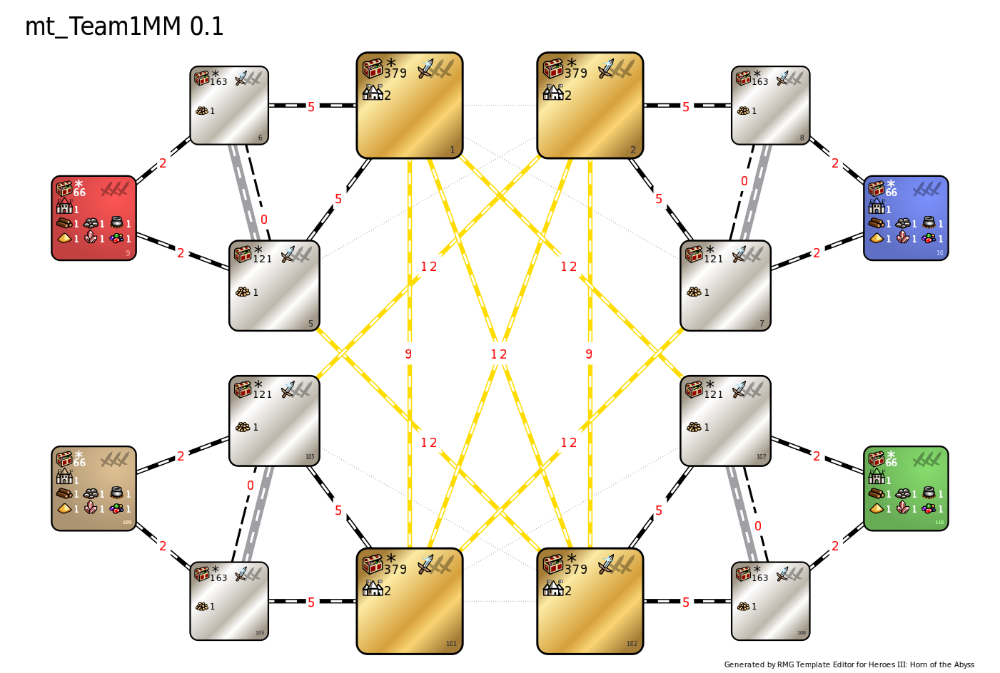

[<<-home](../..)

## mt_Team1MM

**NOTE:** This template is in a alpha stage - it is still being tested, and major changes are still easily possible at this point. Proceed with caution!

[Download mt_Team1MM 0.1](./mt_Team1MM%200.1.zip)

<!-- [Changelog](changelog.html) -->

### Description
Well... welcome to the true insanity. One Minute Madness, but for the 2v2 play. Cooperation will be difficult as hell, and the timer will be even more of a challenge. Good luck.

### Recommended settings
* Map size: L (underground will be a copy of the surface layer)
* Player count: 2
* AI players: 0
* Teams: none
* Water: none
* Monsters: strong
* Difficulty: 160%
* Chess timer: 1+1+3
* Roads: slow
* Sim turns: none
* Additional rules:
    * The early encounter restart rule is disabled.
    * Each team can only perform one day 1 subjective restart (1x111).
    * The starting bonus has to be left random.
    * A single trade system is used. The winners of the auction choose whether they want to pick side (red+tan or blue+green) or both heroes first. The gold trasfer is split evenly between players - this means that on 160% difficulty both sides can bid up to 20 thousand gold.

### Template specifications

* Map size: L (underground will be a copy of the surface layer)
* Zones 9 and 10 are player starting zones.
    * Treasure values: (500-3000, 38)
    * Terrain is corresponding to the towns chosen by the players.
     * Only a subset of objects is allowed to spawn in these zones:
        * Wood, Ore:
            * value: 600
            * frequency: 5
        * Mercury, Sulfur, Crystal, Gems
            * value: 700
            * frequency: 4
        * Gold
            * value: 500
            * frequency: 8
        * Treasure Chest
            * value: 1000
            * frequency: 2
            * Max per zone: 3
        * Campfire
            * value: 800
            * frequency: 3
        * Redwood observatory
            * value: default
            * frequency: 999
            * Max per zone: 1
        * Level 1 dwelling
            * value: default
            * frequency: 999
            * Max per zone: 1
        * Churchyard
            * value: default
            * frequency: 999
            * Max per zone: 1
        * Learning Stone
            * value: default
            * frequency: 999
            * Max per zone: 1
        * Town Gate
            * value: 750
            * frequency: 9999
            * Max per zone: 1
* Zones 6 and 8 are wasteland zones.
    * Treasure values: (2500-3500, 9), (3000-5000, 16), (8000-12000, 4)
    * Terrain is always Wasteland.
    * Treasure Class artifacts have their frequency increased to 275. At most four of them can spawn in this zone.
    * Minor Class artifacts have their frequency increased to 400, while their object value is reduced to 4000. At most four of them can spawn in this zone.
    * Two Pandora's Boxes containing 5000 xp each spawn in this zone.
    * The following creature banks spawn in this zone:
        * 1 Black Tower
        * 1 Imp Cache
    * The Imp Cache has a reduced object value of 2500.
    * The stat boosting objects all have their frequency changed and their amount limited:
        * School of War
            * frequency 500
            * max per zone 2
        * School of Magic
            * frequency 300
            * max per zone 2
        * Marletto Tower
            * frequency 700
            * max per zone 3
        * Mercenary Camp
            * frequency 700
            * max per zone 3
        * Star Axis
            * frequency 600
            * max per zone 2
        * Garden of Revelation
            * frequency 600
            * max per zone 3
        * Arena
            * frequency 200
            * max per zone 1
        * Colosseum of the Magi
            * frequency 200
            * max per zone 1
        * Library of Enlightenment
            * Disabled
    * Additionally, the frequency of Learning Stones is increased to 700 and their max per zone is set to 5.
    * All resources have their frequency reduced to 40, and the Random Resource object has its frequency reduced to 100.
    * The amount of Spell Scrolls and Shrines spawning in this zone is limited to the following:
        * Level 1 scrolls: 3
        * Level 2 scrolls: 2
        * Level 3 scrolls: 1
        * Level 1 shrines: 3
        * Level 2 shrines: 3
        * Level 3 shrines: 2
        * Other levels of both scrolls and shrines are not limited.
    * Trailblazers, Windmills, Derricks, Prospectors, and Warehouses of any kind are disabled in this zone.
* Zones 5 and 7 are grass zones.
    * Treasure values: (1500-3000, 16), (3000-6000, 11), (6000-12000, 4)
    * Terrain is always Grass.
    * A single Stables spawn in this zone, with object value increased to 1000.
    * Water Wheels have their value increased to 1000, and their frequency to 150.
    * A single Pandora's Box containing 5000 xp spawn in this zone.
    * The following creature banks spawn in this zone:
        * 3 Crypts
        * 1 Churchyard
        * 1 Dwarven Treasury
* Zones 1 and 2 are the treasure zones.
    * Treasure values: (3000-6000, 7), (10000-16000, 12), (12000-20000, 6)
    * Terrain is always Desert.
    * Treasure class artifacts are disabled in this zone.
    * Minor class artifacts have their frequency increased to 250, while Major class artifacts have their frequency increased to 800.
    * Two Pandora's Boxes with 10000 experience each spawn in this zone. In case of a very small desert, one or both of the boxes may be missing
    * The following creature banks spawn in this zone
        * 2 Wolf Raider Pickets
        * 2 Dragon Fly Hives
        * 3 Churchyards
    * In addition to these, a single Redwood Observatory and two Libraries of Englightment spawn in each of these zones too. In case of a very small desert, one of the libraries may be missing.
    * Wood and Ore cannot appear in this zone, while other magical resources and gold have their frequency reduced to 50. Campfires have their frequency reduced to 75.
    * Treasure Chests have their frequency increased to 1500.
    * At most three Tier 3 shrines can spawn in this zone.
    * Windmills and Warehouses of any kind are banned from appearing in this zone.
    * Both towns in the zone 1 are of the faction chosen by the red player, while towns in the zone 2 are of the faction chosen by the blue player.
* Unless specified in the zone's description, the following objects are disabled:
    * Creature Banks
    * Prisons
    * Obelisks
    * Town Gates
    * Quest artifacts
    * Spell Scrolls with Fly/Water Walk/Dimension Door/Town Portal
    * Dwellings
    * Trading Posts
    * Taverns
    * Stables
    * Skeleton Transformers
    * Graves
    * Warlock's Labs
    * Magic Springs
    * Black Markets
    * Dens of Thieves
    * Junkmans
    * Libraries of Enlightment
    * Pandora's Boxes
    * Relic class artifacts
    * War Machine Factories
    * Cannon Yards
    * Refugee Camps
* Banned Spells: 
    * Tier 1: Protection from Water, View Air, View Earth
    * Tier 2: Disguise, Remove Obstacle
    * Tier 3: Earthquake, Land Mine, Destroy Undead, Hypnotize, Mirth, Misfortune
    * Tier 4: Armageddon, Town Portal, Slayer, Fire Shield, Sorrow, Counterstrike
    * Tier 5: Dimension Door, Fly, Magic Mirror
* Banned Artifacts: 
    * Treasure: Ring of Vitality, Amulet of the Undertaker, Bird of Perception, Stoic Watchman, Legs of Legion, Necklace of Swiftness, Charm of Mana, Talisman of Mana, Pendant of Dispassion, Pendant of Free Will, Pendant of Life, Pendant of Death, Pendant of Total Recall, Pendant of Holiness,  Bow of Elven Cherrywood 
    * Minor: Emblem of Cognizance, Boots of Speed, Rib Cage Vampire's Cowl, Loins of Legion, Torso of Legion, Bowstring of the Unicorn's Mane, Inexhaustible Cart of Lumber, Inexhaustible Cart of Ore
    * Major: Pendant of Second Sight, Dead Man's Boots, Ambassador's Sash, Wayfarer's Boots, Diplomat's Ring, Statesman's Medal, Orb of Silt, Orb of the Firmament, Orb of Driving Rain, Orb of Tempestuous Fire, Arms of Legion, Head of Legion, Endless Bag of Gold, Endless Purse of Gold, Pendant of Negativity, Angel Feather Arrows, Ring of Infinite Gems, Eversmoking Ring of Sulfur, Everpouring Vial of Mercury, Everflowing Crystal Cloak, Cape of Silence
    * Relic: Angel Wings, Tome of Fire Magic, Tome of Air Magic, Tome of Water Magic, Tome of Earth Magic, Spellbinder's Hat, Endless Sack of Goldc, Spellbinder's Hat, Endless Sack of Gold
* Banned Heroes
    * Castle: Valeska, Lord Haart, Cuthbert
    * Rampart: Mephala, Giselle
    * Tower: Neela, Solmyr
    * Inferno: Calh, Ayden
    * Necropolis: Isra, Aislinn, Thant, Vidomina
    * Dungeon: Deemer
    * Stronghold: Crag Hack, Tyraxor, Gundula
    * Fortress: Tazar
    * Conflux: Thunar, Erdamon
    * Cove: Corkes, Jeremy, Leena
* Banned skills: Eagle Eye, Estates, Learning, First Aid.
* Combat turn limit: 100
