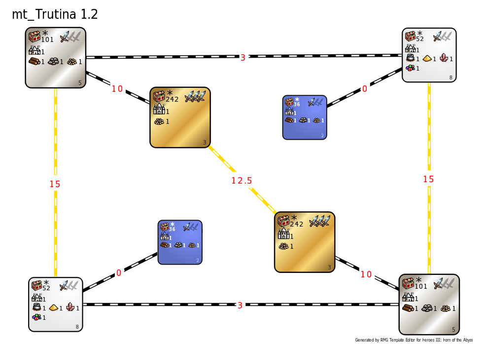

[<<-home](../..)

## mt_Trutina

[mt_Trutina 1.2](./mt_Trutina%201.2.zip)

### Description
This is a mirrorized version of Nova Trutina.

### Recommended settings
* Map size: M+U (underground layer is the copy of the surface layer)
* Player count: 2
* AI players: 0
* Teams: none
* Water: none
* Monsters: strong
* Difficulty: 160%
* Chess timer: 16:00+7:00+1:30
* Roads: medium
* Sim turns: 116

### Template specifications

* Map size: L
* Zone 2 is the player starting zone.
    * Treasure values: (500-2000, 17), (2000-4000, 5)
    * Terrain is corresponding to the towns chosen by the players.
    * Relics and Quest Artifacts are disabled on this zone.
    * A single Redwood Observatory and a single Griffin Conservatory spawns in each of these zones.
    * Additionally, there is a single tier 1 and tier 2 dwelling available for most of the factions. Exceptions are:
        * Tower is given two Workshops at start, instead of a single Workshop and a single Parapet.
        * Dungeon is given two Warrens at start, instead of a single Warren and a single Harpy Loft.
        * Necropolis is given only a single Cursed Temple.
        * Conflux is given only a single Flower of Life.
* Zone 8 is the player secondary zone.
    * Treasure values: (500-3000, 13), (4000-6000, 6)
    * Terrain is randomly chosen from Dirt, Grass, Lava and Highlands.
    * Relics are disaled on this zone.
    * Towns spawning in this zone are always different to the player's choices.
* Zone 5 is the treasure zone.
    * Treasure values: (3000-5000, 11), (5000-10000, 6), (10000-15000, 1)
    * Terrain is always Wasteland.
    * Relics are disaled on this zone.
    * A single Redwood Observatory, two Dragon Fly Hives and two Wolf Raider Pickets spawn in each of these zones.
    * Towns spawning in this zone are always different to the player's choices.
* Zone 3 is the super-treasure zone.
    * Treasure values: (10000-15000, 9), (15000-20000, 6), (20000-
    30000, 1)
    * Terrain is always Desert.
    * A single Dragon Fly Hive, a single Wolf Raider Picket, a single Red Tower and two Dragon Utopias spawn in this zone.
    * Additionally, there are three Spell Scrolls containing a level 5 spell.
    * Town in the zone 4 corresponds to the Red player's choice, while the town in the zone 3 corresponds to the blue player's choice.
* Banned Spells: Fly, Water Walk, Dimension Door, Town Portal
* Banned Artifacts: Angel Wings, Tome of Fire Magic, Tome of Air Magic, Tome of Water Magic, Tome of Earth Magic, Spellbinder's Hat.
* Unless specified in the zone's description, the following objects are disabled:
    * Dragon Utopias
    * Wolf Raider Pickets
    * Experimental Shops
    * Red Towers
    * Dragon Fly Hives
    * Griffin Conservatories
    * Spell Scrolls containing Fly/WW/DD/TP
    * Quests rewarding tier 1-4 units
    * Pandora boxes containing tier 1-4 units
    * Skeleton Transformers
    * Prisons
    * Obelisks
    * Creature dwellings.
* Banned heroes:
    * Standard mirror bans: Kyrre, Gunnar, Alamar, Jeddite, Dessa, Luna, Labetha, Grindan, Miriam
    * Eagle Eye specialists: Sanya, Malcom, Serena, Nimbus, Geon, Oris, Tiva
* Allowed hero: Adrienne.
* Combat turn limit: 100