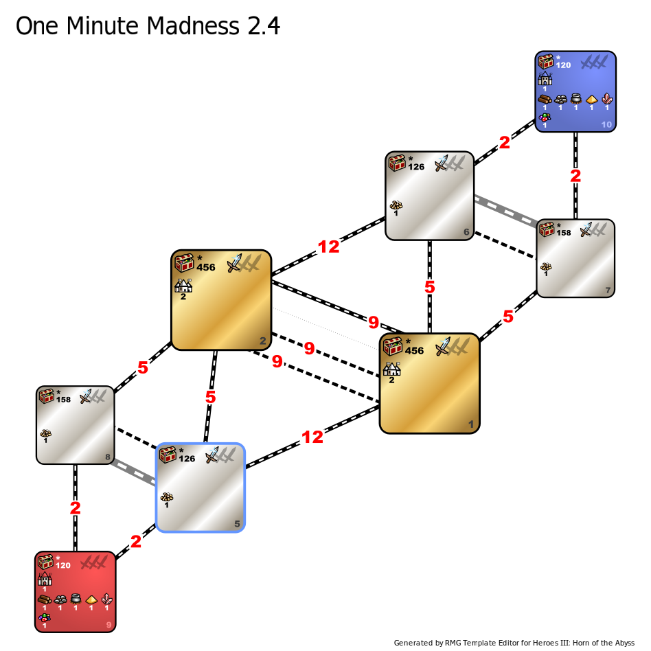

[<<-home](../..)

## One Minute Madness

**NOTE:** This template is in an Alpha release - it is in progress of being playtested and adjusted for higher amounts of both fun and balance.

[One Minute Madness 0.2](./One%20Minute%20Madness%200.2.zip)

[Changelog](changelog.html)

### Description
One Minute Madness is (probably) the first template ever made specifically for one minute timers.

### Recommended settings
* Map size: L
* Player count: 2
* AI players: 0
* Teams: none
* Water: none
* Monsters: strong
* Difficulty: 160%
* Chess timer: 1 min classical or 1+1+1 chess
* Roads: medium
* Sim turns: 117

### Template specifications

* Map size: L
* Zones 9 and 10 are player starting zones.
    * Treasure values: (500-3000, 36)
    * Terrain is corresponding to the towns chosen by the players.
     * Only a subset of objects is allowed to spawn in these zones:
        * Wood, Ore:
            * value: 600
            * frequency: 25
        * Mercury, Sulfur, Crystal, Gems
            * value: 700
            * frequency: 20
        * Gold
            * value: 500
            * frequency: 40
        * Treasure Chest
            * value: 1000
            * frequency: 10
            * Max per zone: 3
        * Campfire
            * value: 800
            * frequency: 15
        * Redwood observatory
            * value: default
            * frequency: 9999
            * Max per zone: 1
        * Level 1 dwelling
            * value: default
            * frequency: 9999
            * Max per zone: 1
        * Churchyard
            * value: default
            * frequency: 9999
            * Max per zone: 1
        * Learning Stone
            * value: default
            * frequency: 9999
            * Max per zone: 1
* Zones 6 and 8 are wasteland zones.
    * Treasure values: (1500-3000, 9), (3000-5000, 12), (8000-12000, 3)
    * Terrain is always Wasteland.
    * Relic class artifacts are disabled in this zone.
    * Treasure Class artifacts have their frequency increased to 225. At most four of them can spawn in this zone.
    * Minor Class artifacts have their frequency increased to 300, while their object value is reduced to 4000. At most four of them can spawn in this zone.
    * A single Town Gate spawns in this zone, with a reduced object value of 4000.
    * A single Pandora's Box containing 5000 xp spawn in this zone.
    * The following creature banks spawn in this zone:
        * 1 Black Tower
        * 1 Imp Cache
        * 1 Medusa Stores
    * The Imp Cache has a reduced object value of 2500.
    * Derricks are disabled in this zone.
* Zones 5 and 7 are grass zones.
    * Treasure values: (1500-3000, 12), (3000-6000, 10), (6000-12000, 4)
    * Terrain is always Grass.
    * Relic class artifacts are disabled in this zone.
    * A single Tavern and a single Stables both spawn in this zone.
    * Two Pandora's Boxes containing 5000 xp each spawn in this zone.
    * The following creature banks spawn in this zone:
        * 3 Crypts
        * 1 Churchyard
        * 1 Dwarven Treasury
        * 1 Naga Bank
* Zones 1 and 2 are the treasure zones.
    * Treasure values: (3000-6000, 9), (10000-15000, 6), (15000-20000, 1)
    * Terrain is always Desert.
    * Treasure class artifacts are disabled in this zone.
    * Minor and Major class artifacts have their frequency increased to 300.
    * Up to four Pandora's Boxes with 10000 experience each can spawn in this zone. They have the default object value and their frequency is increased to 300.
    * The following creature banks spawn in this zone:
        * 2 Cyclops Stockpiles
        * 2 Wolf Raider Pickets
        * 2 Dragon Fly Hives
        * 3 Mansions
    * In addition to these, a single Redwood Observatory and two Libraries of Englightment spawn in each of these zones too.
    * Both towns in the zone 1 are of the faction chosen by the red player, while towns in the zone 2 are of the faction chosen by the blue player.
* Unless specified in the zone's description, the following objects are disabled:
    * Creature Banks
    * Prisons
    * Obelisks
    * Town Gates
    * Quest artifacts
    * Spell Scrolls with Fly/Water Walk/Dimension Door/Town Portal
    * Dwellings
    * Trading Posts
    * Taverns
    * Stables
    * Skeleton Transformers
    * Graves
    * Warlock's Labs
    * Magic Springs
    * Black Markets
    * Dens of Thieves
    * Junkmans
    * Libraries of Enlightment
    * Pandora's Boxes
* Banned Spells: Fly, Disguise, Dimension Door, Town Portal, Protection from Water, View Air, View Earth, Remove Obstacle, Earthquake, Land Mine, Fire Shield, Slayer and Magic Mirror.
* Banned Artifacts: Angel Wings, Tome of Fire Magic, Tome of Air Magic, Tome of Water Magic, Tome of Earth Magic, Spellbinder's Hat, Wayfarer's Boots, Vampire's Cowl, Dead Man's Boots, Amulet of the Undertaker, Ambassador's Sash, Diplomat's Ring, Statesman's Medal, Orb of Driving Rain, Bird of Perception, Stoic Watchman, Emblem of Cognizance, Legs of Legion, Loins of Legion, Torso of Legion, Arms of Legion, Head of Legion.
* Banned heroes: Sanya, Malcom, Serena, Ash, Nimbus, Geon, Oris, Tiva, Ayden.
* Banned skills: Eagle Eye, Learning, First Aid.
* Combat turn limit: 100