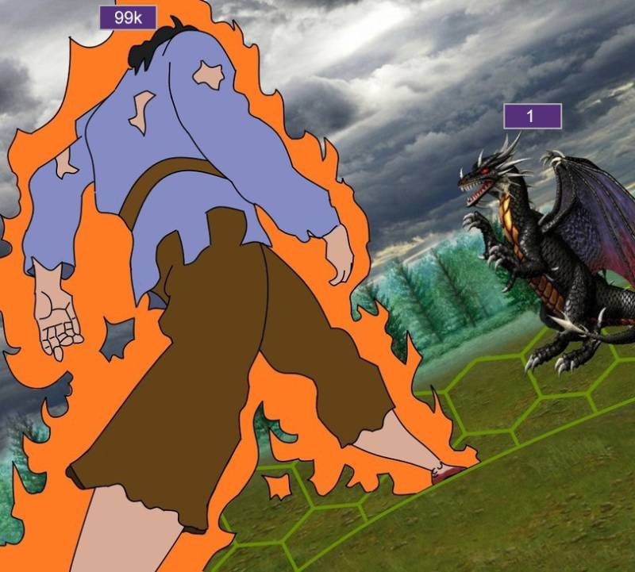
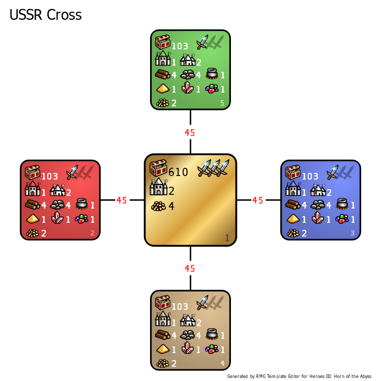

[<<-home](../..)

## USSR Cross

[Download USSR Cross](./USSR%20Cross.zip)

### Description

I think this image should be enough of a description.

### Recommended settings
* Map size: XL
* Player count: 2
* AI players: 0
* Teams: none
* Water: none
* Monsters: **normal**
* Difficulty: 160%
* Chess timer: 16+8+2
* Roads: fast
* Sim turns: 117
* Additional rules
    * Same as in Jebus Cross template.

### Template specifications

* Map size: L or XL
* Necropolis and Inferno are banned, and can't spawn on the map.
* Taverns, Mineral Springs and Hermit's shacks have their maximum changed to 3.
* Griffin Conservatories, Dragon Fly Hives, Red Towers, Wolf Raider Pickets, Experimental Shops, Skeleton Transformers and Quest artifacts are disabled.
* The only dwelling that can spawn on the map is Hovel. This dwelling has its frequency increased to 1500.
* The only type of Pandora's Box that can spawn is a box with 150 Peasants. This Pandora's Box has it's frequency increased to 1500.
* In all zones, dwelling and creature rewards are set to only neutral.
* Combat turn limit: 100