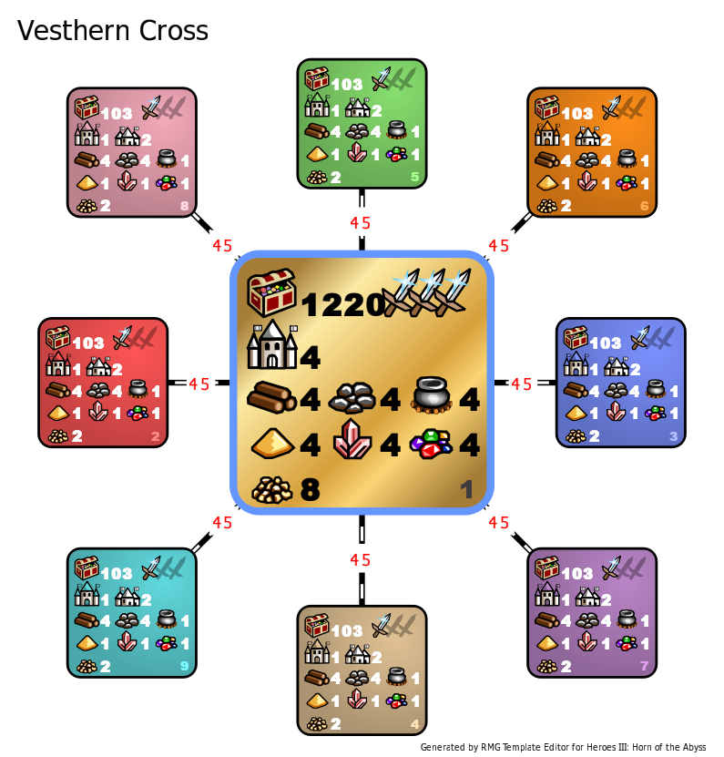

[<<-home](../..)

## Vesthern Cross

*Original author unknown - please contact me if you know who the author is.*

[Vesthern Cross 1.6.0](./Vesthern%20Cross%201.6.0.zip)

### Description
Vesthern Cross is a giant-sized Jebus Cross where everything is allowed. And when I say anything, I **mean** anything. Recruiting Gelu from Tavern? Check. Picking up a pre-assembled Cloak of the Undead King? Check. Spamming Armageddon with the Armageddon's Blade? Check. Abusing pre-nerf diplomacy? Check. Anything can happen, and anything can become your win condition.

### Recommended settings
* Map size: G
* Player count: 8
* AI players: 0
* Teams: none, two, or four
* Water: none
* Monsters: strong
* Difficulty: 160%
* Classic timer: 1 minute (if playing an 8 player game)
* Roads: fast
* Sim turns: 127 (if playing with 1 minute timers)
* Additional rules
    * Tournament Rules setting is disabled.
    * Castle and bonuses choice should be left random if playing with more than 2 players.

### Template specifications

* Map size: G
* Zones 2-9 are the players' starting zones.
    * Treasure values: (300-3000, 14), (5000-16000, 6), (12000-22000, 1)
    * Terrain is corresponding to the towns chosen by the players.
* Zone 1 is the super-treasure zone.
    * Treasure values: (20000-50000, 10), (50000-70000, 10), (70000-110000, 3)
    * Terrain is always Desert.
* Every single artifact, spell and secondary skill is disabled. This includes pre-assembled combination artifacts and heroes, and both Resistance and Interference skills.
* Taverns, Mineral Springs and Hermit's Shacks have their maximum per zone increased to 3.
* The Anarchy setting is enabled.
* Diplomacy settings are set to the pre 1.6.0 values in all zones:
    * Disposition: Hostile (4-10)
    * Joining Percent: 100%
    * Join only for money: Disabled
* Combat turn limit: 100