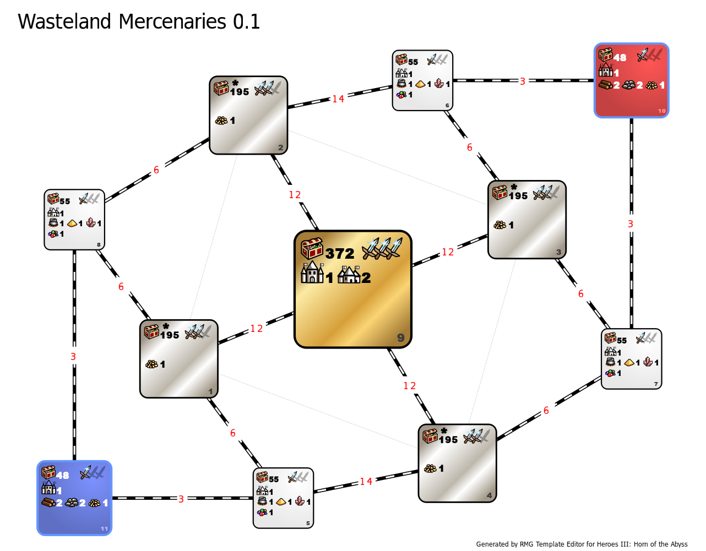

[<<-home](../..)

## Wasteland Mercenaries

**NOTE:** This template is in a Proof of Concept stage - it was not tested, and as such it may not provide a fun and/or balanced experience.

[Download Wasteland Mercenaries 0.1](./Wasteland%20Mercenaries%200.1.zip)

### Description
This template is split into four main areas: two player areas, the tituar Wasteland and a hostile, yet rich desert. The Wasteland is filled with monsters ready to be recruited by anyone who gives them enough money. Monsters in the desert can't ever be swayed to your side, though. They will declare you as invanders and will always fight you - no matter what is your diplomacy level.

### Recommended settings
* Map size: L
* Player count: 2
* AI players: 0
* Teams: none
* Water: none
* Monsters: strong
* Difficulty: 160%
* Chess timer: 21:00+8:00+1:15
* Roads: medium
* Sim turns: 117

### Template specifications

* Map size: L
* Zones 10-11 are player's starting zones.
    * Treasure values: (500-3000, 15), (3000-6000, 5)
    * Terrain is corresponding to the factions chosen by the players.
* Zones 5-8 are player secondary zones.
    * Treasure values: (500-3000, 9), (3000-6000, 6), (10000-15000, 1)
    * Terrain and villages are corresponding to the factions chosen by the players.
* Zones 1-4 are the titular Wasteland zones.
    * Treasure values: (5000-10000, 5), (10000-15000, 10), (15000-20000, 5)
    * Only a subset of objects is allowed to spawn in these zones:
        * Wood, Ore:
            * value: 3000
            * frequency: 100
        * Mercury, Sulfur, Crystal, Gems
            * value: 4000
            * frequency: 75
        * Gold
            * value: 3000
            * frequency: 50
        * Treasure Chest
            * value: 5000
            * frequency: 50
        * Campfire
            * value: 5000
            * frequency: 50
        * Minor Artifact
            * value: 7500
            * frequency: 30
        * Major Artifact
            * value: 12500
            * frequency: 20
        * Warlock's Lab
            * value: 10000
            * frequency: 9999
            * Max per zone: 1
    * Diplomacy settings for this zone are changed to:
        * Disposition: Compliant (always join)
        * Joining percent: 100%
        * Join only for money: Active
* Zone 9 is the super-treasure zone.
    * Treasure values: (10000-15000, 10), (15000-20000, 7), (20000-30000, 5)
    * Terrain is always Desert.
    * The main town is always of different faction than the one chosen by the players.
    * One of the villages is of the same faction as the red player, while the other is the of the same faction as the blue player.
    * Monster disposition is set to Savage - and as such, they will never join the player.
* Combat turn limit: 100